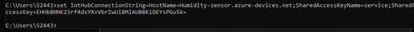

# Azure IoT Hub


**Introducción.**

El IoT o "Internet of Things" describe la red de objetos físicos ("cosas") que llevan incorporados sensores, software y otras tecnologías con el fin de conectarse e intercambiar datos con otros dispositivos y sistemas a través de Internet. Estos dispositivos van desde objetos domésticos comunes hasta herramientas industriales sofisticadas.

Por otra parte el *Azure IoT Hub* es un servicio administrado alojado en la nube de Azure que se puede utilizar como nodo central de mensajes para la comunicación bidireccional entre ArcGIS Velocity y dispositivos de IdC.

Para demostrar la forma en que la nube y un dispositivo IoT interactuan, dejare esta práctica donde conectare un simulador *Raspberry pi* y enviare los datos a un IoT Hub de forma local y otra usando los servisios de Azure como *App Sevice*.

**Requisitos:**

- Cuenta de [Azure](https://azure.microsoft.com/es-es/get-started/azure-portal/)
- Lenguaje [Node.js](https://nodejs.org/es/)
- [Git](https://git-scm.com/downloads)
- [CLI Azure](https://learn.microsoft.com/en-us/cli/azure/install-azure-cli)
- [Visual Studio Code](https://code.visualstudio.com/)


---------------------------------------


## Practica sensor de temperatura IoT Hub.


### Primera Parte: Conectar el IoT Hub al simulador.

1. Desde el portal de Azure, en la barra de busqueda escribe *IoT Hub* y crea uno.


 - Deja el acceso publico de redes habilitado para evitar problemas.
 - Los demás valores se pueden quedar en predeterminado.
 - Al terminar da clic en crear.

2. Dirigete al recurso, una vez dentro busca en el lateral izquierdo "dispositivos", crea uno dandode el nombre que quieras y guardalo.


Una vez que tu dispositivo aparezca da clic en el y busca **cadena de conexión principal**. Copea el contenido.
    - Para este paso deveras tener habilitado el portapapeles.


3. Nos dirigiremos al [Simulador Raspberry](https://azure-samples.github.io/raspberry-pi-web-simulator/#GetStarted). Una vez dentro da clic en **Reset**, busca la linea 15 del código y pega lo que habías copeado.


    - Eliminarás todo lo siguiente de la linea: [Your IoT Hub divice connection string] dejando solo las comillas simples.
    - Dentro de estas irá tu cadena de conección que copeaste anteriormente.

Puedes comprobar si funciona bien dandole en **Run**. Te devera aparecer lo siguiente:


Una vez que comprobaste que si esta conectado puedes detener el proceso para completar el resto.

- Nota: También se pueden conectar otros dispositivos como Arduinos u controladores.

Con esto ya tenemos conectado un dispositivo que esta mandando en tiempo real señales de temperatura a nuestro IoT Hub pero... ¿Cómo comprobamos que realmente lo esta haciendo?
No sabemos si realmente esta recibiendo lo que nuestro sensor le manda porque no tenemos un entorno gráfico dentro del IoT hub de Azure, así que haremos lo siguiente:


-----------------------------------------


### Segunda Parte: Crear un entorno ded Visualización gráfica.

Para crear un entorno gráfico existen 2 formas:
- Local.
- Con App Service.
Les mostrare de las 2 formas.

Pero antes tenemos que crar un App Service an Azure.
Usaremos la terminal de Azure pero también lo puedes crear de lorma tradicional.

1. Abre la terminal de Azure.


    Si no has creado una cuenta de almacenamiento crala en la misma terminal y espera aque termine para poder usarla.

Copea lo siguiente el la terminal:
```GitHub
az iot hub connection-string show --hub-name ("Nombre de tu dispositivo") --policy-name service
```
- Borra lo que esya despues de --hun-name y escribe el nombre de tu dsipositivo.


Copea lo que te arroja y guardalo en un txt o en algún lugar que recuerdes.


Lo siguiente lo haré desde la terminal en local pero puedes seguir usando la de azure, en caso de que quieras hacerlo como yo da clic [Aquí](https://learn.microsoft.com/en-us/cli/azure/install-azure-cli)
Para usar la CLI de Azure en local abre la terminal o simbolo del sistema de tu computadora y escribe: az login. Una vez que hayas iniciado seción con tu escribe "az" en la terminal y da enter, listo ahora puedes usar el CLI de Azure en local.


#### Forma Local.

Para poder realizar todo de forma más sencilla recurriremos a un repositorio de GitHub que contiene documentación de Azure para el uso de IoT Hub.
- [Repositorio de GitHub](https://github.com/Azure-Samples/web-apps-node-iot-hub-data-visualization)

Para lo siguiente tenemos 2 formas de hacerlo:
- Codespaces de GitHub.
- Por medio de [Visual Studio Code](https://code.visualstudio.com/)

En mi caso usare VsCode porque mi cuenta no tiene habilitado los codespaces, en cualquiera de las 2 formas se hace lo mismo.

1. Clona el repositorio en una carpeta de tu computadora.

    - En Windows puedes acceder a ella dando clic en la parte superior y escribiendo *cmd* o de la forma tradicional entrnado al simbolo del sistema y escribiendo la ruta de la carpeta.
    - Cuando estes dentro del sombolo del sistema o la terminal copea lo siguiente.
        ```GitHub
        git clone https://github.com/Azure-Samples/web-apps-node-iot-hub-data-visualization.git
        ```
    - Presiona enter y empezara a clonar el repositorio.

**Nota**: Lo anterior solo funciona si tienes [Git](https://git-scm.com/downloads) instaldo.


2. Creación de un *Grupo de Consumo*.

Copea lo siguinete en la terminal:

```GitHub
az iot hub consumer-group show create --hub-name ("Nombre que gustes") --name ("Nombre que quieras")
```
- Cambia lo que esta entre paréntesis por un nombre que gustes.

Da clic en enter y si te aparece lo siguiente esta bien.


- Guarda lo que te salga donde esta señalado en el mismo lugar que el pasado.


3. Habre la carpeta en [Visula Studio Code](https://code.visualstudio.com/).


Busca **Terminal** en VsCode y da clic en
*"nueva terminal"*.

- **Nota**: Para este paso necesitaremos tener instaldo
[Node.js](https://nodejs.org/es/).

Dentro de la terminal copea lo siguiente:
```GitHub
npm install
```
Da clic en enter y espera que termine el proceso.


Ahora copea lo siguiente:
```GitHub
npm start
```


- Copea lo que tengas dentro que esta señalado y pegalo en el buscador de VsCode.


- Da clic donde señala la flecha amarilla.

4. Cambiar variables de entorno.

Esto permitira tener una mayor seguridad a la hora de enviar y recibir dados desde la nube a un dispositivo.
- Busca tu clave guardada.


A esta clave que guardaste añadele un "set" al inicio.


Te tiene que quedar algo así.
Ahora copea todo esto y pegalo un tu terminal, ya que VsCode no nos permite hacer lo siguiente:



Si no te sale nada despues de dale en enter esta bien.

- Añade lo que esta subrayado al nombre que guardaste cuando creaste tu grupo de consumo.


Pegalo antes del nombre y escribe un = dejanto todo junto sin espacios.


Al igual que el anterior, si no te arroja nada esta correcto.

- Escribe la dirección de la carpeta del repositorio que clonaste.


- Ejecuta el siguiente comando:
```GitHub
npm start
```


- Busca en tu navegador *localhost:(numero que te da en listening on)*.
- Corre el simulador y en tu terminal debe salir algo como esto:


Una vez entres al navegador y recargues la página te debe aparecer algo similar a lo siguiente:


Con esto concluimos la ejecucion local si te interesa conocer la forma de hacerlo en la nube sigue leyendo el resto.

--------------------------------


#### En Azure.

Aremos uso de la terminal de Azure para lo siguiente:

1. Abre la terminal de Azure y ejecuta lo siguiente cambaindo lo que este entre paréntesis:

```GitHub
az appservice plan create --name ("Dale un nombre") --resource-group ("El nombre del grupo de recursos de tu iot") --sku FREE
```


- Al terminar copia y cambia lo que esta entre paréntesis:

```GitHub
az webapp create -n ("Dale un nombre") -g ("El nombre del grupo de recursos de tu iot") -p planappserviceiot --runtime "node|14LTS" --deployment-local-git
```


- Habilitar el HTTPS only:

```GitHub
az webapp update -n ("Nombre que le diste") -g ("El nombre del grupo de recursos de tu iot") --https-only true
```


- Ahora copea lo siguiente:

```GitHub
az webapp config set -n ("Nombre que le diste") -g ("El nombre del grupo de recursos de tu iot") --web-sockets-enabled true
```


- Una vez que este dirigete al centro de implementación de tu app service. Ve a credenciales GIT/FTPS y escribe un usuario y una contraseña. Al finalizar guárdalo.


Copear el URI de Git clone.


2. Haciendo uso de VSCode escribir el la terminal:

```GitHub
git remote add webapp ("URL del git clone")
```


Añadir los siguientes comandos:

```GitHub
git branch
```
```GitHub
git push webapp ("la rama que te arrojo el branch")
```

- Esto te abrirá una interfaz para escribir tu usuario y contraseña.


Empezara a crear el programa, mientras tanto nosotros agregaremos las variables de entorno.

3. Te dirigiras a configuración y después a nueva configuración de la aplicación.

Copea en el orden que se muestra en la imagen.


    - **Nota**:Anteriormente te mostré como obtener estas variables de entorno.

Añade la otra y guardarlas.


- Si en el VSCode te aparece esto es que ya esta funcionando.


4. Ahora solo dirígete a la URL y listo, podrás visualizar la gráfica.


Ahora la pagina puede verla cualquiera porque ya es una pagina publica de Azure.

